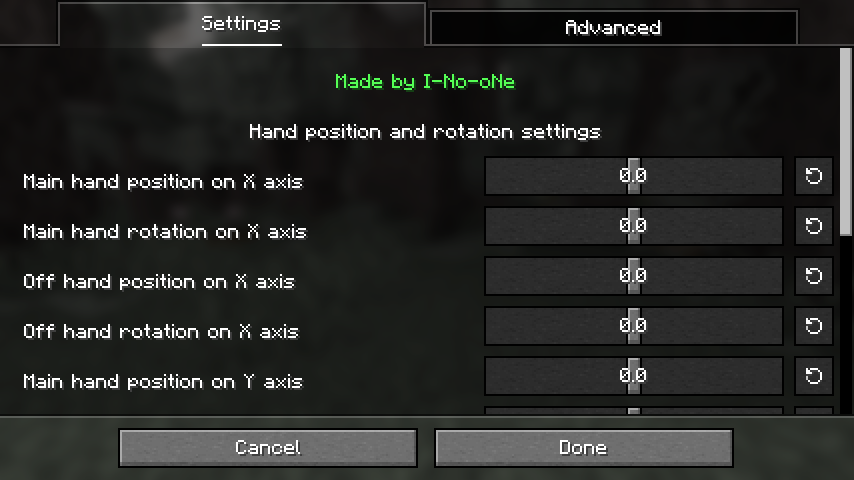
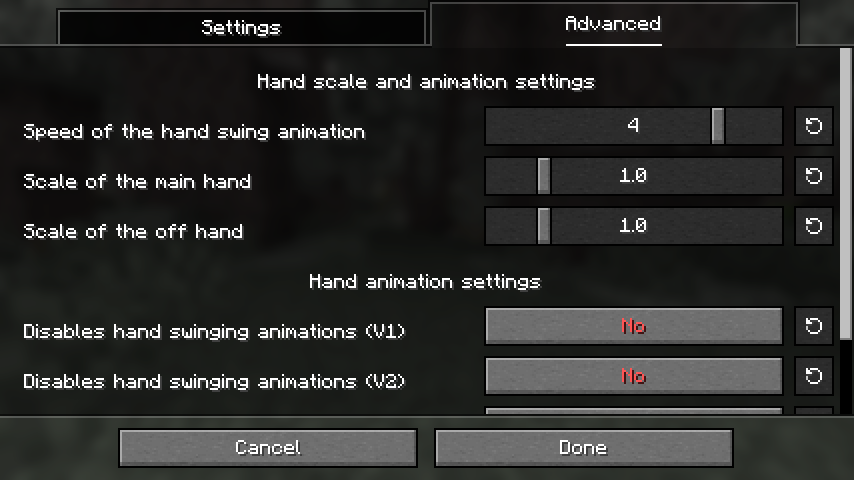
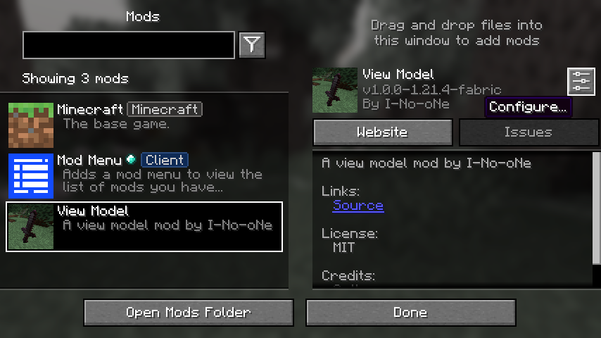

# View Model Mod By I-No-oNe
-----------------
```yml
How to use?
# Install the latest version and install Midnight Config Lib.
# Press the keybind V on your keyboard to open the GUI.
# Set the sizes as you want with the sliders.
# Turn on/off the settings as you want.
```
--------------------
## Showcase:
### GUI

### Advanced Settings GUI:

----------
### Setting The Keybind

--------------------
### Mod Menu Integration:

--------------------
### In-game Example:

-----------------

**BE AWARE THAT YOU MUST TO DOWNLOAD THE [**MIDNIGHT LIB**](https://modrinth.com/mod/midnightlib) IN ORDER TO THE MOD TO WORK!**

------------------
**thank you for using this mod** 🙏

