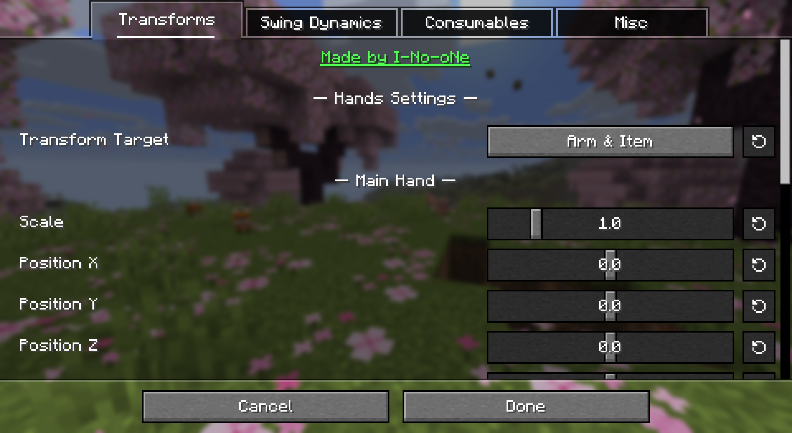
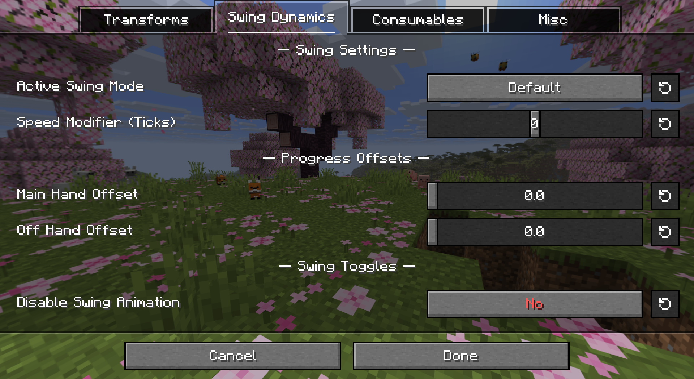
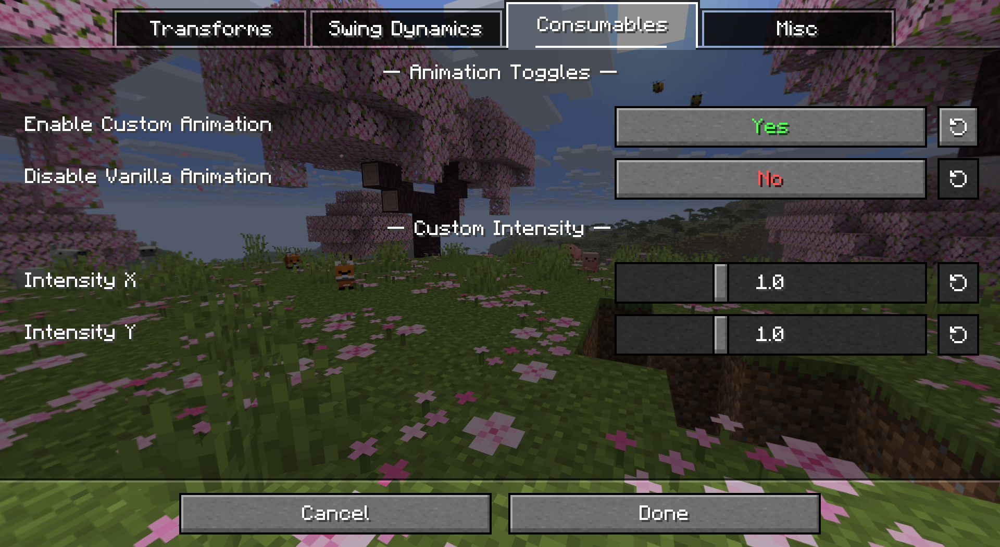
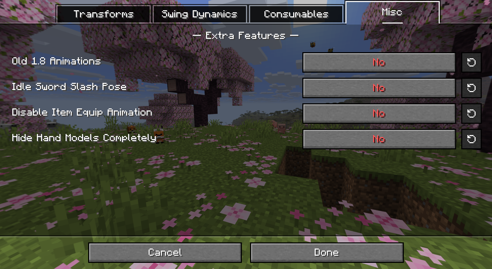
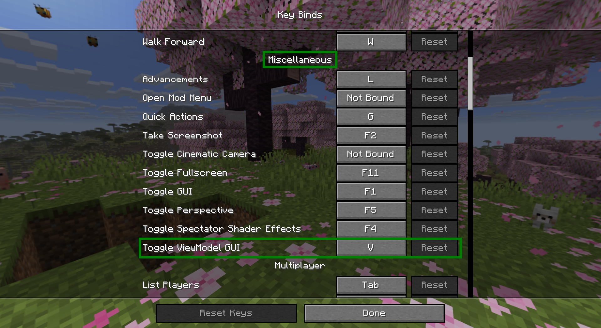
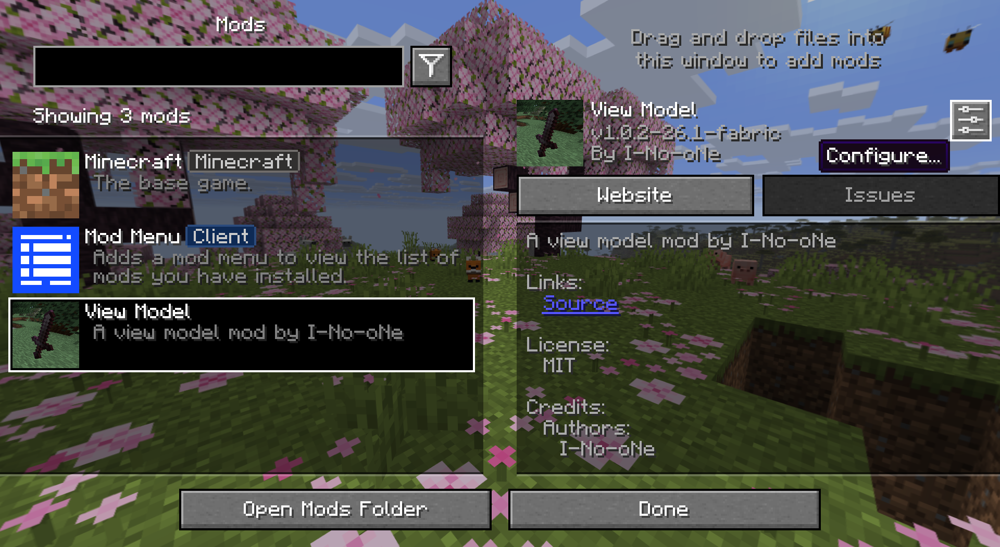

# View Model Mod By I-No-oNe
-----------------

> [!NOTE]
> From now releases will be available **ONLY** on [**Modrinth**](https://modrinth.com/mod/no-ones-view-model), [**Github Releases**](https://github.com/I-No-oNe/View-Model/releases) won't get any updates, if you curious why, read about it [**here**](assets/github_explanation.png).

-----------------
```yml
How to use:
# Install the latest version and install Midnight Config Lib.
# Press the keybind V on your keyboard to open the GUI.
# Set the sizes as you want with the sliders.
# Turn on/off the settings as you want.
```
--------------------

## Showcase:

### GUI:

|                 **Transforms**                  |                **Swing Settings**                |
|:-----------------------------------------------:|:------------------------------------------------:|
|  |  |
|                 **Consumables**                 |                     **Misc**                     |
|  |  |

### Setting The Keybind:

--------------------
### Mod Menu Integration:


-----------------

> [!WARNING]
> **BE AWARE THAT YOU MUST DOWNLOAD [**MIDNIGHT LIB**](https://modrinth.com/mod/midnightlib) IN ORDER TO
USE THE MOD!**

------------------
**thank you for using the mod** 🙏

