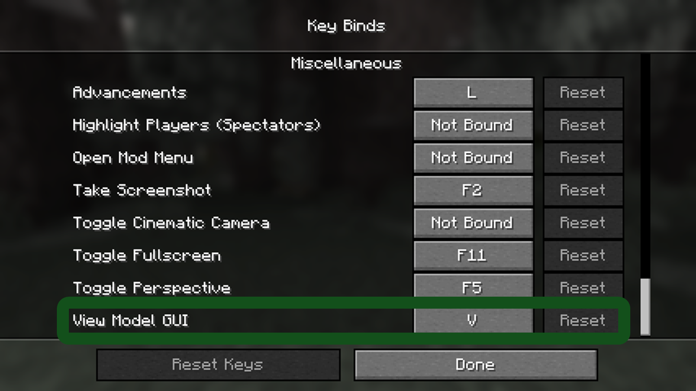

# View Model Mod
-----------------
### How to use?
- **Install** the latest version and install [*ImproperUI*](https://github.com/ItziSpyder/ImproperUI/releases) by **ImproperIssues**.
- **Press** `v` on your keyboard to open the **GUI**.
- **Set** the sizes as you want with the sliders.
--------------------
## Examples:
-------
## GUI

----------
## Setting The Keybind

--------------------
## Example

-----------------
# BE AWARE THAT YOU MUST TO HAVE THE [***ImproperUI***](https://github.com/ItziSpyder/ImproperUI/releases) LIBRARY SO THIS MOD WILL WORK!
------------------
### tysm for this mod 🙏